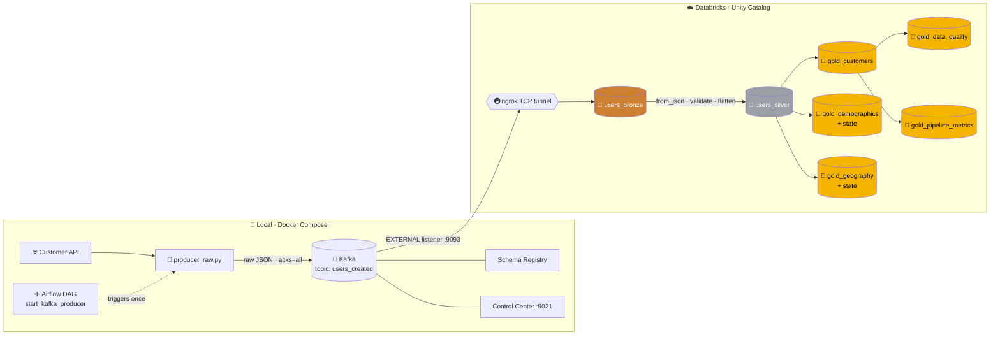
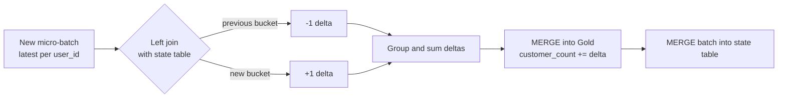

<div align="center">


[](#)
[](#)
[](#)
[](#)
[](#)
[](#)
[](#)

### 🌐 `Customer API` ➜ `✈️ Airflow` ➜ `🐍 Producer` ➜ `📨 Kafka` ➜ `🚇 ngrok` ➜ `🧱 Databricks` ➜ `🥉 🥈 🥇`

**A fully local-to-cloud streaming platform: Dockerized Kafka + Airflow feeding a Databricks declarative pipeline that builds Bronze, Silver and five Gold tables, in real time.**

</div>

---

## ✨ Highlights

| | Feature | Details |
|---|---|---|
| 📨 | **Raw-first ingestion** | Producer publishes the API payload *unmodified*, so Bronze is a true source-of-truth |
| ✈️ | **Airflow-triggered, always-on** | One manual DAG run starts a continuous producer that polls every second |
| 🛑 | **Graceful shutdown** | `SIGTERM`/`SIGINT` handlers flush and close the producer cleanly |
| 🔒 | **Durable delivery** | `acks="all"` with `retries=5` |
| 🚇 | **Local Kafka ➜ cloud Databricks** | A second `EXTERNAL` listener exposed through an **ngrok TCP tunnel** |
| 🧱 | **Declarative pipelines** | `@dp.table`, `@dp.materialized_view`, `@dp.foreach_batch_sink`, `@dp.append_flow` |
| 🧠 | **Delta-based incremental aggregates** | Demographics and geography maintained with +1 / -1 deltas via state tables |
| 🩺 | **Built-in observability** | Profile-completeness scoring and processing-latency metrics (negative values clamped to 0) |
| ✅ | **SQL quality gate** | Row-count reconciliation, duplicate and null checks in one script |

---

## 🏗️ Architecture



---

## 🧱 Medallion Layers

All tables live in **`data_engineering_project.kafka_pipeline`**.

### 🥉 Bronze: `users_bronze`
Streaming read from Kafka (`startingOffsets = earliest`), keeping the native Kafka columns: `key`, `value`, `topic`, `partition`, `offset`, `timestamp`, `timestampType`. Nothing is parsed here.

### 🥈 Silver: `users_silver`
Parses the JSON `value` with an explicit schema (`from_json`), drops malformed records and rows missing `login.uuid`, flattens nested attributes and stamps processing metadata.

### 🥇 Gold

| Table | Type | Purpose |
|---|---|---|
| 👤 `gold_customers` | Materialized view | Latest record per `user_id`, ordered by `injection_timestamp` then `processing_timestamp` |
| ✅ `gold_data_quality` | Materialized view | Profile completeness score (0 to 7) and quality label |
| ⏱️ `gold_pipeline_metrics` | Materialized view | `processing_latency_seconds`, clamped at 0 to avoid negative clock-skew values |
| 👥 `gold_demographics` + `gold_demographic_state` | Streaming `foreachBatch` sink | Customer counts by gender × age group × nationality |
| 🌍 `gold_geography` + `gold_geography_state` | Streaming `foreachBatch` sink | Customer counts by country × state × city |

<details>
<summary><b>✅ Data quality scoring</b></summary>

| Score | Classification |
|:-:|---|
| 7 | 🟢 Complete |
| 5–6 | 🟡 Mostly Complete |
| 3–4 | 🟠 Partially Complete |
| 0–2 | 🔴 Poor |

</details>

<details>
<summary><b>👥 Age groups</b></summary>

`Under 18` · `18-25` · `26-35` · `36-50` · `51+`

</details>

---

## 🧠 Incremental Aggregation with State Tables

Demographics and geography never rescan the full customer base. Each micro-batch is compared against a **state table**, and only the change is applied:



If a customer's attributes change, the old bucket is decremented and the new one incremented, so counts stay exactly correct while only touching the current batch.

---

## 📁 Repository Structure

```text
.
├── 📂 dags/
│   └── start_kafka_producer.py        # Airflow DAG (manual trigger)
├── 📂 databricks/
│   ├── 00_setup.sql                   # catalog, schema, checkpoint volume
│   ├── my_transformation.py           # Bronze → Silver → Gold pipeline
│   └── Kafka_Pipeline_Quality_Check.sql
├── docker-compose.yml                 # Kafka, Schema Registry, Control Center, Airflow, Postgres
├── producer_raw.py                    # always-on raw Kafka producer
├── requirements.txt
├── .env.example                       # copy to .env
└── README.md
```

---

## 🚀 Getting Started

### Prerequisites
Docker Desktop · an [ngrok](https://ngrok.com) account · a Databricks workspace with Unity Catalog

### 1️⃣ Start Kafka and the tunnel
```bash
# Expose the Kafka EXTERNAL listener
ngrok tcp 9093
```
Copy the forwarding address (e.g. `0.tcp.in.ngrok.io:12345`) and create your env file:
```bash
cp .env.example .env
# edit .env  ->  KAFKA_EXTERNAL_ADVERTISED=0.tcp.in.ngrok.io:12345
```

### 2️⃣ Launch the local stack
```bash
docker compose up -d
```

| Service | URL |
|---|---|
| ✈️ Airflow | http://localhost:8080 |
| 🎛️ Confluent Control Center | http://localhost:9021 |
| 📚 Schema Registry | http://localhost:8081 |

### 3️⃣ Start streaming
Open Airflow, unpause and **trigger `start_kafka_producer`** once. The producer now runs continuously and publishes to `users_created`.

### 4️⃣ Set up Databricks
1. Run `databricks/00_setup.sql` to create the catalog, schema and checkpoint volume.
2. Set `KAFKA_BOOTSTRAP_SERVERS` in `databricks/my_transformation.py` to your ngrok address.
3. Create a **Lakeflow Declarative Pipeline** pointing at `my_transformation.py` and start it.

### 5️⃣ Validate
Run `databricks/Kafka_Pipeline_Quality_Check.sql`.

> ⚠️ **ngrok free endpoints change on restart.** When that happens, update `.env`, recreate the broker (`docker compose up -d --force-recreate broker`) and update `KAFKA_BOOTSTRAP_SERVERS` in the pipeline.
>
> 🛑 Stop normally with `docker compose down`. **Avoid `down -v`**, which deletes the Kafka and Airflow volumes.

---

## ✅ Data Quality Checks

`Kafka_Pipeline_Quality_Check.sql` verifies:

- 📊 Row counts and latest timestamps across every table
- 🔁 No duplicate `user_id` groups in Silver
- 🚫 No null critical keys
- ⏱️ No negative latency values in `gold_pipeline_metrics`
- 🔗 Bronze, Silver and Gold counts reconcile

---

## ⚙️ Configuration

| Variable | Default | Where |
|---|---|---|
| `KAFKA_BOOTSTRAP_SERVERS` | `broker:29092` | Producer / DAG |
| `POLL_INTERVAL_SECONDS` | `1.0` | Producer / DAG |
| `API_URL` | Customer API endpoint URL | Producer / DAG |
| `KAFKA_EXTERNAL_ADVERTISED` | none, set in `.env` | docker-compose |

---

## 🛠️ Tech Stack

| Layer | Technology |
|---|---|
| Source | Customer API |
| Orchestration | Apache Airflow 2.6 |
| Messaging | Apache Kafka (Confluent Platform 7.4), Schema Registry, Control Center |
| Containers | Docker Compose |
| Tunnel | ngrok (TCP) |
| Processing | Databricks, Spark Structured Streaming, Lakeflow Declarative Pipelines |
| Storage | Delta Lake, Unity Catalog |

---

## 🗺️ Roadmap

- [ ] Replace ngrok with a managed Kafka service (Confluent Cloud / MSK)
- [ ] Add authentication and TLS on the Kafka listener
- [ ] Move pipeline config (bootstrap servers) into pipeline parameters
- [ ] Dashboards on the Gold tables (Databricks SQL / Power BI)
- [ ] Alerting on data-quality and latency regressions
- [ ] CI/CD with Databricks Asset Bundles

---

## 📄 License

Distributed under the **MIT License**. See [`LICENSE`](LICENSE) for details.

---

<div align="center">

### ⭐ If you found this useful, please star the repo!

**Built with ❤️ by [Kiran Avulapati](https://github.com/YOUR_USERNAME)**


</div>
